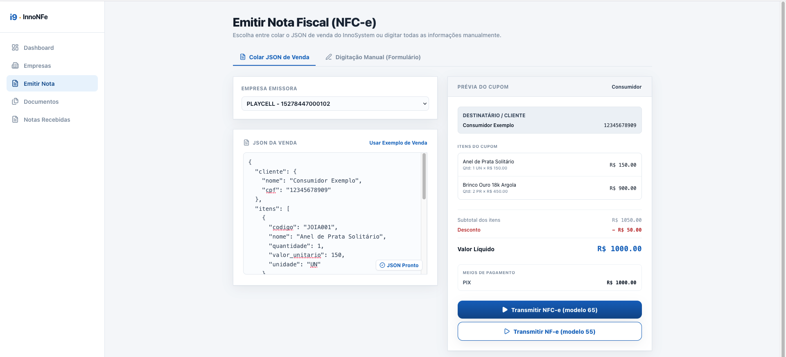
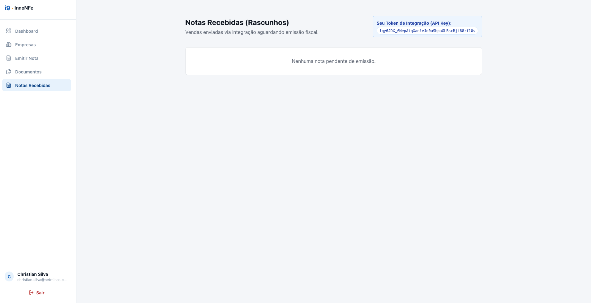

# Integração InnoSystem → InnoFiscal

**Ambiente:** `https://inno-fiscal.fly.dev`
**Login de teste:** `christian.silva@netminas.com.br` / `123456`

Duas formas de mandar a venda pro InnoFiscal:

- **Opção 1 — Colar JSON:** copia o JSON no InnoSystem e cola em `Emitir Nota`.
- **Opção 2 — API:** POST direto em `/integracao/receber-venda`.

O payload é o mesmo nas duas.

---

## Opção 1 — Colar JSON

1. No InnoSystem, gerar o JSON abaixo e jogar na área de transferência (`navigator.clipboard.writeText(...)`).
2. Abrir InnoFiscal → **Emitir Nota** → aba **Colar JSON de Venda** → Ctrl+V → Transmitir.



**JSON:**

```json
{
  "cliente": {
    "nome": "Consumidor Exemplo",
    "cpf": "12345678909"
  },
  "itens": [
    {
      "codigo": "JOIA001",
      "nome": "Anel de Prata Solitário",
      "quantidade": 1,
      "valor_unitario": 150,
      "unidade": "UN"
    },
    {
      "codigo": "JOIA002",
      "nome": "Brinco Ouro 18k Argola",
      "quantidade": 2,
      "valor_unitario": 450,
      "unidade": "PR"
    }
  ],
  "desconto": 50,
  "pagamentos": [
    {
      "meio_pagamento": "17",
      "valor": 1000
    }
  ]
}
```

---

## Opção 2 — API

**Token:** InnoFiscal → menu **Notas Recebidas** → canto superior direito: `Seu Token de Integração (API Key)`.



Guardar esse token na conta do cliente dentro do InnoSystem, pra não precisar copiar toda vez.

**Endpoint:**

```
POST https://inno-fiscal.fly.dev/integracao/receber-venda
```

**Headers:**

| Header         | Valor                              |
|----------------|-------------------------------------|
| `X-API-Key`    | Token do usuário (imagem acima)     |
| `Content-Type` | `application/json`                  |

**Body:** mesmo JSON da Opção 1.

**curl:**

```bash
curl -X POST https://inno-fiscal.fly.dev/integracao/receber-venda \
  -H "X-API-Key: lqy6JDX_6NepAtqXanleJo0uSbpaGLBscRji88rf10s" \
  -H "Content-Type: application/json" \
  -d '{
  "cliente": {
    "nome": "Consumidor Exemplo",
    "cpf": "12345678909"
  },
  "itens": [
    {
      "codigo": "JOIA001",
      "nome": "Anel de Prata Solitário",
      "quantidade": 1,
      "valor_unitario": 150,
      "unidade": "UN"
    },
    {
      "codigo": "JOIA002",
      "nome": "Brinco Ouro 18k Argola",
      "quantidade": 2,
      "valor_unitario": 450,
      "unidade": "PR"
    }
  ],
  "desconto": 50,
  "pagamentos": [
    {
      "meio_pagamento": "17",
      "valor": 1000
    }
  ]
}'
```

Depois do POST, o rascunho aparece na tela **Notas Recebidas** do InnoFiscal — o operador conclui a emissão por lá.

---

## Campos do payload

**`cliente`**

| Campo  | Tipo   | Obrig. | Nota                                    |
|--------|--------|--------|-----------------------------------------|
| `nome` | string | sim    |                                         |
| `cpf`  | string | *      | 11 dígitos, só números. Use CPF **ou** CNPJ |
| `cnpj` | string | *      | 14 dígitos, só números                  |

**`itens`** (mínimo 1)

| Campo            | Tipo    | Obrig. | Nota                          |
|------------------|---------|--------|-------------------------------|
| `codigo`         | string  | não    | SKU do InnoSystem             |
| `nome`           | string  | sim    | Máx. 120 caracteres           |
| `quantidade`     | number  | sim    | > 0, aceita decimal           |
| `valor_unitario` | number  | sim    | Em reais, aceita decimal      |
| `unidade`        | string  | sim    | `UN`, `PR`, `KG`, `CX`, etc.  |

**`desconto`** (opcional, default `0`) — valor em reais aplicado no total (não é %).

**`pagamentos`** — código SEFAZ tPag:

| Código | Meio                    | Código | Meio                  |
|--------|-------------------------|--------|-----------------------|
| `01`   | Dinheiro                | `15`   | Boleto                |
| `02`   | Cheque                  | `16`   | Depósito              |
| `03`   | Cartão de Crédito       | `17`   | PIX                   |
| `04`   | Cartão de Débito        | `18`   | Transferência         |
| `05`   | Crédito Loja            | `19`   | Fidelidade            |
| `10`   | Vale Alimentação        | `90`   | Sem pagamento (fiado) |
| `11`   | Vale Refeição           | `99`   | Outros                |

**`numero_pedido_externo`** (opcional) — id da venda no InnoSystem.

**`valor_total`** — **não mandar.** O servidor calcula `Σ(qtd × unitário) − desconto`.

---

## Resposta (200 OK)

```json
{
  "id": 42,
  "status": "rascunho",
  "modelo": "65",
  "valor_total": 1000.0,
  "empresa_id": null,
  "chave_acesso": null,
  "numero": null,
  "serie": null,
  "criado_em": "2026-08-06T14:22:18.123Z",
  "atualizado_em": "2026-08-06T14:22:18.123Z"
}
```

Guardar o `id` no InnoSystem para não reenviar a mesma venda.

## Erros

| HTTP | detail                                             |
|------|----------------------------------------------------|
| 401  | `Header X-API-Key é obrigatório para integração.`  |
| 401  | `X-API-Key inválida ou usuário não encontrado.`    |
| 403  | `Usuário inativo.`                                 |
| 422  | Validação Pydantic (campo inválido/faltando)       |
